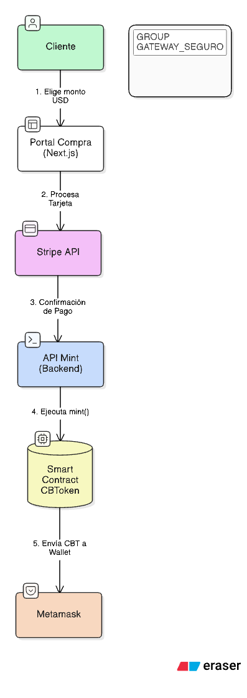
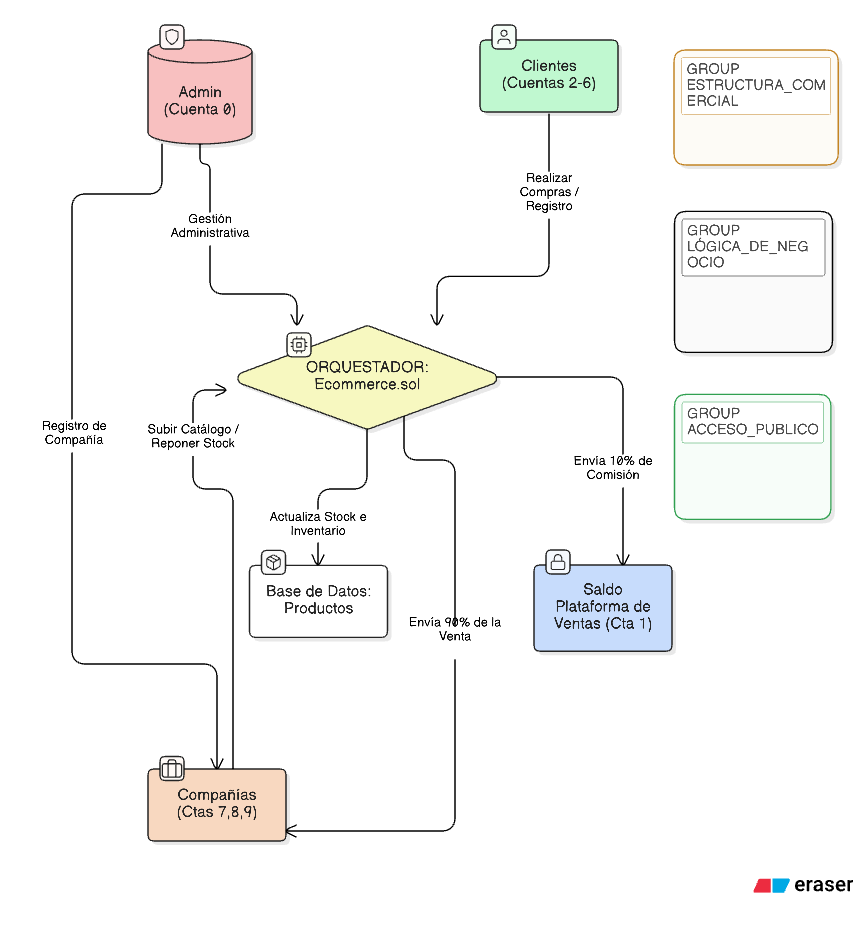
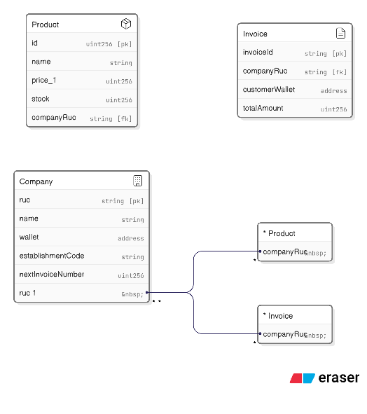
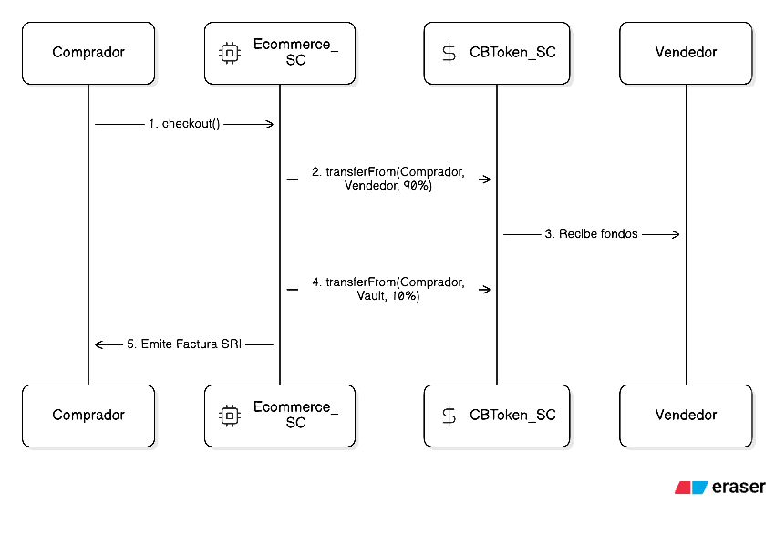
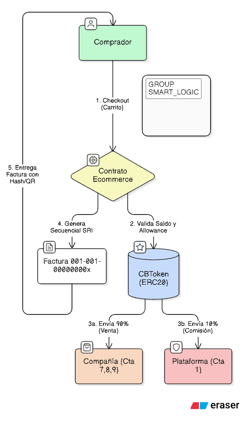

# Evidencias para el Informe Técnico - Fases Iniciales

Este documento recopila las salidas de consola y verificaciones más importantes para documentar el progreso del proyecto.

---

## 1. Infraestructura y Estructura Base

### Estructura de Directorios
Es fundamental mostrar que el proyecto sigue la arquitectura solicitada.
**Comando:** `ls -R` o `tree` (si está instalado).
**Resultado esperado:**
```text
.
├── Documentacion
│   ├── Discurso_Video.md
│   ├── Evidencias_Informe.md
│   ├── Implementation_Plan.md
│   └── Task.md
├── sc-ecommerce
│   ├── foundry.toml
│   ├── script
│   ├── src
│   └── test
├── stablecoin
│   ├── compra-stablecoin
│   ├── pasarela-de-pago
│   └── sc
│       ├── foundry.toml
│       ├── package.json
│       ├── script
│       ├── src
│       └── test
└── web-admin
└── web-customer
```

---

## 2. Parte 1: CBToken (Stablecoin)

### Compilación Exitosa
Demuestra que el código de Solidity es válido y las dependencias están bien configuradas.
**Comando:** `cd stablecoin/sc && forge build`
**Resultado:**
```text
[⠊] Compiling...
[⠒] Compiling 8 files with Solc 0.8.33
[⠢] Solc 0.8.33 finished in 36.56ms
Compiler run successful!
```

### Pruebas Unitarias (Tests)
Esta es la captura más importante para la validez técnica.
**Comando:** `forge test -vv`
**Resultado:**
```text
Ran 4 tests for test/CBToken.t.sol:CBTokenTest
[PASS] testRevert_MintByNonOwner() (gas: 14466)
[PASS] test_InitialSetup() (gas: 25372)
[PASS] test_MintByOwner() (gas: 68472)
[PASS] test_Transfer() (gas: 95356)
Suite result: ok. 4 passed; 0 failed; 0 skipped; finished in 7.15ms (5.12ms CPU time)
```

### Despliegue en Red Local (Anvil)
Captura del momento en que el contrato se hace real en la blockchain.
**Comando sugerido (Usuario):** `forge script script/DeployCBToken.s.sol --rpc-url http://localhost:8545 --broadcast`
**Evidencia a capturar:** El log que muestra `CBToken deployed at: 0x...` y los hashes de las transacciones.

### Verificación de Balance (Cast)
Prueba final de que el mint inicial funcionó.
**Comando sugerido (Usuario):** `cast call <ADDR_TOKEN> "balanceOf(address)" <ADDR_OWNER>`
**Resultado esperado (Hex):** `0x00...e8d4a51000`

> [!NOTE]
> Para convertir el resultado hexadecimal a decimal automáticamente y facilitar tu informe, puedes usar:
> `cast --to-dec 0xe8d4a51000`
> Resultado: `1000000000000` (representa 1,000,000 CBT con 6 decimales).

---

## 3. Parte 2: App de Compra de Stablecoins

### Build Exitoso de Next.js
Confirmación de que la aplicación frontend y sus APIs están listas.
**Comando:** `cd stablecoin/compra-stablecoin && npm run build`
**Resultado (Verificado 04/02/2026):**
```text
✓ Finalizing page optimization
Route (app)
┌ ○ /
├ ○ /_not-found
├ ƒ /api/create-payment-intent
└ ƒ /api/mint-tokens
```

### Integración y UI Premium
- **Hook useWeb3**: Gestión de estados de MetaMask.
- **API Minting**: Lógica de backend para interactuar con el Smart Contract tras el pago.
- **Stripe Elements**: Interfaz de pago segura implementada.
- **Diseño Responsivo**: Reestructuración del layout para evitar solapamientos en dispositivos móviles y resoluciones bajas (Flexbox nativo).
- **Animaciones**: Implementación de Micro-animaciones (Next.js/Tailwind) para transiciones fluidas.

### Archivos Relevantes Creados
Para esta fase de la aplicación de compra, se han desarrollado los siguientes archivos clave:

1.  **Configuración y Estilos:**
    - `stablecoin/compra-stablecoin/src/app/globals.css`: Sistema de diseño premium y tokens de CSS.
    - `stablecoin/compra-stablecoin/src/types/index.d.ts`: Definiciones globales para compatibilidad de TypeScript con MetaMask.
    - `stablecoin/compra-stablecoin/.env.local`: Configuración de variables de entorno (Stripe y Blockchain).

2.  **Lógica Web3 y UI:**
    - `stablecoin/compra-stablecoin/src/hooks/useWeb3.ts`: Hook personalizado para gestionar la conexión con la wallet.
    - `stablecoin/compra-stablecoin/src/components/PurchaseCard.tsx`: Componente principal que coordina el flujo de compra.
    - `stablecoin/compra-stablecoin/src/components/CheckoutForm.tsx`: Integración con Stripe Elements para el formulario de pago.

3.  **Backend (API Routes):**
    - `stablecoin/compra-stablecoin/src/app/api/create-payment-intent/route.ts`: Endpoint para iniciar pagos en Stripe.
    - `stablecoin/compra-stablecoin/src/app/api/mint-tokens/route.ts`: Lógica segura que ejecuta el `mint` del Smart Contract tras validar el pago.

4. **Diagrama de Flujo**


---

## 4. Parte 3: Pasarela de Pago con Tokens

### Build Exitoso de la Pasarela
**Comando:** `cd stablecoin/pasarela-de-pago && npm run build`
**Resultado (Verificado 05/02/2026):**
```text
✓ Finalizing page optimization
Route (app)
┌ ○ /
└ ○ /_not-found
```

### Componentes de Pago
- **useWeb3 Hook**: Implementado para gestión de conexión y balance.
- **PaymentProcessor**: Interfaz de pago con resumen de orden y validación de saldo CBT.
- **Interacción Blockchain**: Ejecución de `transfer` hacia la wallet del comercio.

- **Sincronización de UI (Pasarela & Portal de Compra)**: Unificación visual de ambas aplicaciones siguiendo el esquema horizontal solicitado. Ahora el Portal de Compra (6001) es 100% transparente, mostrando la billetera receptora y el saldo antes de la transacción.
- **Gestión de Errores Amigables**: Implementación de traducciones dinámicas para errores de MetaMask (ej: "rejected" ahora se muestra como "rejected - Transacción Cancelada por el Usuario").
- **Persistencia y Sincronización Global**: Refactorización de `useWeb3.ts` en ambos proyectos para detección automática de MetaMask y actualización de balance en tiempo real.
- **Responsividad Unificada y Adaptativa**: Implementación de encabezados "Stack / Flex" que se apilan verticalmente en móviles (`flex-col`) para evitar solapamientos y se distribuyen horizontalmente en escritorio (`sm:flex-row`).
- **Arquitectura de Roles y Segregación de Fondos**: División estricta de responsabilidades por cuenta (Tesorería, Comercio, Clientes, Proveedores) para garantizar la integridad de la reserva inicial (1M CBT) y la transparencia en las ventas.

### 4. Arquitectura de Roles (Anvil)
Para garantizar una contabilidad limpia y proteger los fondos de reserva, se ha implementado el siguiente esquema de segregación:

| Actor | Dirección MetaMask | Propósito | Restricciones de Aplicación |
| :--- | :--- | :--- | :--- |
| **Tesorería (Admin)** | `0xf39F...2266` (Cuenta 0) | Custodia del 1M CBT inicial. | Bloqueado para compra de tokens/productos. |
| **Comercio (Ventas)** | `0x7099...79C8` (Cuenta 1) | Receptor oficial de ingresos por ventas. | Bloqueado para autocompra de productos. |
| **Clientes** | `Cuenta 2 a 6` | Usuarios finales de la plataforma. | Sin restricciones (Flujo completo CBT). |
| **Proveedores** | `Cuenta 7 a 9` | Abastecimiento (Futura expansión). | Pueden comprar tokens/ítems actualmente. |

### Archivos Relevantes de la Pasarela
Se han desarrollado los siguientes archivos para la lógica de pago:

1.  **Lógica y Hooks:**
    - `stablecoin/pasarela-de-pago/src/hooks/useWeb3.ts`: Gestión de conexión y balance local profesional.
    - `stablecoin/pasarela-de-pago/src/types/index.d.ts`: Tipados globales para compatibilidad con MetaMask.
2.  **Interfaz de Usuario (Frontend):**
    - `stablecoin/pasarela-de-pago/src/components/PaymentProcessor.tsx`: Procesador de pagos con validación de saldo en tiempo real.
    - `stablecoin/pasarela-de-pago/src/app/page.tsx`: Integración del procesador y diseño responsivo.
3.  **Configuración de Estilos:**
    - `stablecoin/pasarela-de-pago/src/app/globals.css`: Sistema de diseño premium y animaciones.
4. **Diagrama de Flujo**


---

## 5. Parte 4: Smart Contracts de E-Commerce (SRI Edition)

### Resumen de Arquitectura
Se ha implementado una solución modular para cumplir con los requisitos del SRI de Ecuador y la lógica de negocio avanzada:
- **Modularidad:** Uso de librerías (`CompanyLib`, `ProductLib`, `InvoiceLib`, `ClientLib`, `CartLib`) para una gestión eficiente de datos y reducción de costos de gas.
- **Cumplimiento SRI:** Facturación secuencial por empresa (ej: `001-001-000000001`) y cálculo de IVA segregado (0% y 15%).
- **Incentivos:** Sistema de cobro de comisiones dinámicas (10% normal, 7% por volumen, 0% VIP).

### Diagramas de Arquitectura




### Archivos Relevantes de la Fase 4

Para tu informe técnico, estos son los archivos principales que componen esta fase:

1.  **Contrato Orquestador:**
    - `sc-ecommerce/src/Ecommerce.sol`: Contiene toda la lógica de negocio, pagos y facturación.
2.  **Librerías Modulares (Lógica de Soporte):**
    - `sc-ecommerce/src/libraries/CompanyLib.sol`: Gestión de empresas y comisiones.
    - `sc-ecommerce/src/libraries/ProductLib.sol`: Gestión de productos y precios por volumen.
    - `sc-ecommerce/src/libraries/InvoiceLib.sol`: Generación de datos de facturación SRI.
3.  **Seguridad y Pruebas:**
    - `sc-ecommerce/test/Ecommerce.t.sol`: Suite de pruebas que garantiza que no haya errores de dinero o stock.
4.  **Infraestructura de Despliegue:**
    - `sc-ecommerce/script/DeployEcommerce.s.sol`: Script para instalar todo en la blockchain.
    - `sc-ecommerce/foundry.toml`: Configuración técnica para optimizar el contrato.

### Cómo ejecutar los Tests manualmente (Para tu Informe)
Para capturar las evidencias de funcionamiento de los Smart Contracts, sigue estos pasos:

1.  **Abre una terminal** y navega a la carpeta del contrato:
    ```bash
    cd "sc-ecommerce"
    ```
2.  **Ejecuta el comando de pruebas:**
    ```bash
    forge test -vv
    ```
3.  **Captura de Pantalla Sugerida:** Captura la salida de la terminal donde se vean todos los tests marcados como `[PASS]`. Esto demuestra que el contrato es seguro y funcional.

#### Tests Verificados:
- `testRegisterCompany`: Registro exitoso de RUC y datos de empresa.
- `testAddProductPermissions`: Validación de roles (Admin vs Vendedor).
- `testStockSafety`: Protección contra compras superiores al inventario disponible.
- `testFullPurchaseAndSplit`: Venta completa con cálculo de IVA y reparto automático de fondos (90% al vendedor, 10% a plataforma).

### Cómo Desplegar el Contrato en Anvil (Local)

Para que tu aplicación web pueda hablar con el contrato, primero debes "subirlo" a la blockchain local. Sigue estos pasos:

1.  **Asegúrate de que Anvil esté corriendo** en una terminal aparte.
2.  **Obtén la dirección de tu CBToken:** Debes tener a mano la dirección que obtuviste al desplegar el token (ej: `0x5Fb...`).
3.  **Ejecuta el script de despliegue:**
    ```bash
    cd "sc-ecommerce"
    export CBTOKEN_ADDRESS=0x5FbDB2315678afecb367f032d93F642f64180aa3
    forge script script/DeployEcommerce.s.sol --rpc-url http://localhost:8545 --broadcast
    ```
4.  **Captura del Despliegue:** Toma una captura de los logs de la terminal donde diga `Ecommerce deployed at: 0x...`. Esa dirección es la que usaremos más adelante en el Frontend.

---

> [!IMPORTANT]
> **Para tu informe:** Te recomiendo tomar capturas de pantalla de tu propia terminal cuando ejecutes el despliegue en Anvil, ya que eso mostrará las direcciones reales que se generen en tu máquina.
