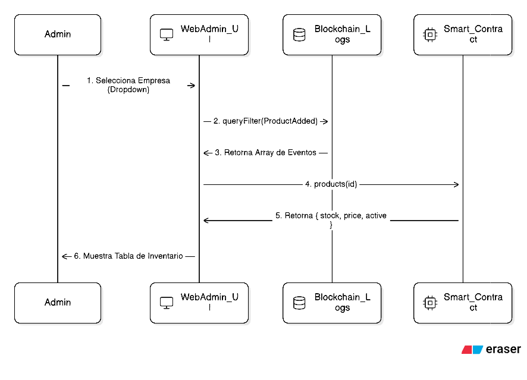
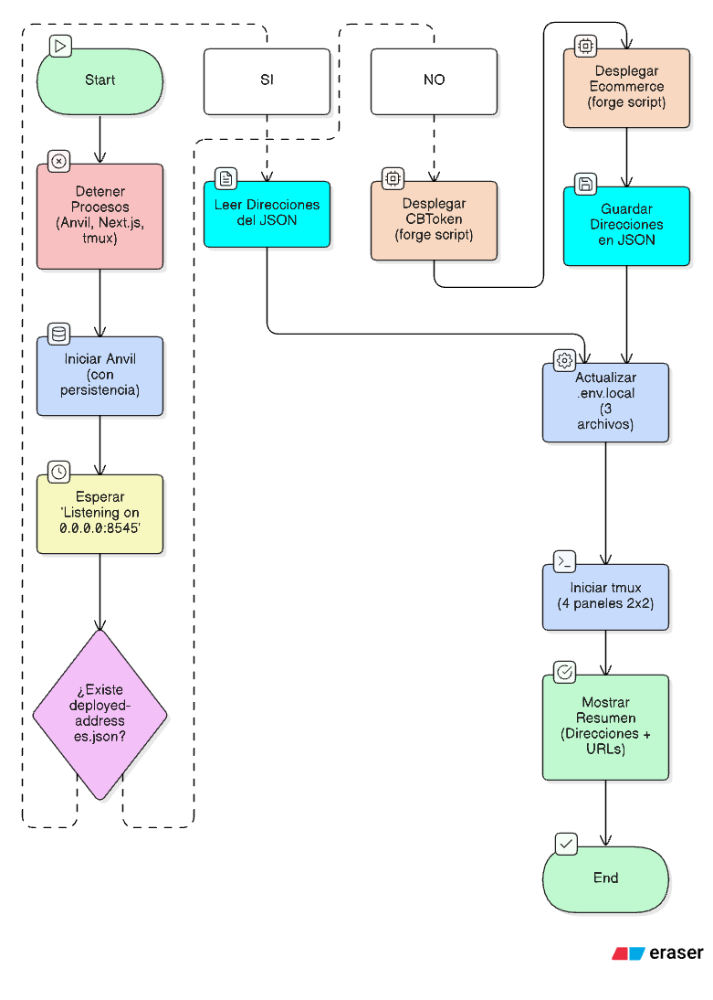
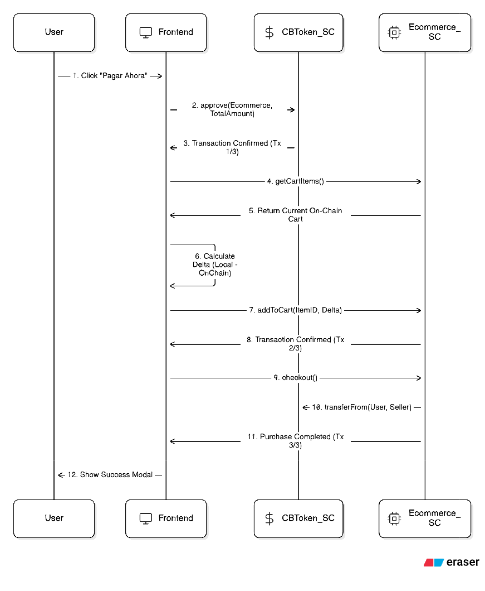

# Evidencias para el Informe Técnico - Fases Iniciales

Este documento recopila las salidas de consola y verificaciones más importantes para documentar el progreso del proyecto.

---

## 1. Infraestructura y Estructura Base

### Estructura de Directorios
Es fundamental mostrar que el proyecto sigue la arquitectura solicitada.
**Comando:** `ls -R` o `tree` (si está instalado).
**Resultado esperado:**
```text
.
├── Documentacion
│   ├── Discurso_Video.md
│   ├── Evidencias_Informe.md
│   ├── Implementation_Plan.md
│   └── Task.md
├── sc-ecommerce
│   ├── foundry.toml
│   ├── script
│   ├── src
│   └── test
├── stablecoin
│   ├── compra-stablecoin
│   ├── pasarela-de-pago
│   └── sc
│       ├── foundry.toml
│       ├── package.json
│       ├── script
│       ├── src
│       └── test
└── web-admin
└── web-customer
```

---

## 2. Parte 1: CBToken (Stablecoin)

### Compilación Exitosa
Demuestra que el código de Solidity es válido y las dependencias están bien configuradas.
**Comando:** `cd stablecoin/sc && forge build`
**Resultado:**
```text
[⠊] Compiling...
[⠒] Compiling 8 files with Solc 0.8.33
[⠢] Solc 0.8.33 finished in 36.56ms
Compiler run successful!
```

### Pruebas Unitarias (Tests)
Esta es la captura más importante para la validez técnica.
**Comando:** `forge test -vv`
**Resultado:**
```text
Ran 4 tests for test/CBToken.t.sol:CBTokenTest
[PASS] testRevert_MintByNonOwner() (gas: 14466)
[PASS] test_InitialSetup() (gas: 25372)
[PASS] test_MintByOwner() (gas: 68472)
[PASS] test_Transfer() (gas: 95356)
Suite result: ok. 4 passed; 0 failed; 0 skipped; finished in 7.15ms (5.12ms CPU time)
```

### Despliegue en Red Local (Anvil)
Captura del momento en que el contrato se hace real en la blockchain.
**Comando sugerido (Usuario):** `forge script script/DeployCBToken.s.sol --rpc-url http://localhost:8545 --broadcast`
**Evidencia a capturar:** El log que muestra `CBToken deployed at: 0x...` y los hashes de las transacciones.

### Verificación de Balance (Cast)
Prueba final de que el mint inicial funcionó.
**Comando sugerido (Usuario):** `cast call <ADDR_TOKEN> "balanceOf(address)" <ADDR_OWNER>`
**Resultado esperado (Hex):** `0x00...e8d4a51000`

> [!NOTE]
> Para convertir el resultado hexadecimal a decimal automáticamente y facilitar tu informe, puedes usar:
> `cast --to-dec 0xe8d4a51000`
> Resultado: `1000000000000` (representa 1,000,000 CBT con 6 decimales).

---

## 3. Parte 2: App de Compra de Stablecoins

### Build Exitoso de Next.js
Confirmación de que la aplicación frontend y sus APIs están listas.
**Comando:** `cd stablecoin/compra-stablecoin && npm run build`
**Resultado (Verificado 04/02/2026):**
```text
✓ Finalizing page optimization
Route (app)
┌ ○ /
├ ○ /_not-found
├ ƒ /api/create-payment-intent
└ ƒ /api/mint-tokens
```

### Integración y UI Premium
- **Hook useWeb3**: Gestión de estados de MetaMask.
- **API Minting**: Lógica de backend para interactuar con el Smart Contract tras el pago.
- **Stripe Elements**: Interfaz de pago segura implementada.
- **Diseño Responsivo**: Reestructuración del layout para evitar solapamientos en dispositivos móviles y resoluciones bajas (Flexbox nativo).
- **Animaciones**: Implementación de Micro-animaciones (Next.js/Tailwind) para transiciones fluidas.

### Archivos Relevantes Creados
Para esta fase de la aplicación de compra, se han desarrollado los siguientes archivos clave:

1.  **Configuración y Estilos:**
    - `stablecoin/compra-stablecoin/src/app/globals.css`: Sistema de diseño premium y tokens de CSS.
    - `stablecoin/compra-stablecoin/src/types/index.d.ts`: Definiciones globales para compatibilidad de TypeScript con MetaMask.
    - `stablecoin/compra-stablecoin/.env.local`: Configuración de variables de entorno (Stripe y Blockchain).

2.  **Lógica Web3 y UI:**
    - `stablecoin/compra-stablecoin/src/hooks/useWeb3.ts`: Hook personalizado para gestionar la conexión con la wallet.
    - `stablecoin/compra-stablecoin/src/components/PurchaseCard.tsx`: Componente principal que coordina el flujo de compra.
    - `stablecoin/compra-stablecoin/src/components/CheckoutForm.tsx`: Integración con Stripe Elements para el formulario de pago.

3.  **Backend (API Routes):**
    - `stablecoin/compra-stablecoin/src/app/api/create-payment-intent/route.ts`: Endpoint para iniciar pagos en Stripe.
    - `stablecoin/compra-stablecoin/src/app/api/mint-tokens/route.ts`: Lógica segura que ejecuta el `mint` del Smart Contract tras validar el pago.

4. **Diagrama de Flujo**


---

## 4. Parte 3: Pasarela de Pago con Tokens

### Build Exitoso de la Pasarela
**Comando:** `cd stablecoin/pasarela-de-pago && npm run build`
**Resultado (Verificado 05/02/2026):**
```text
✓ Finalizing page optimization
Route (app)
┌ ○ /
└ ○ /_not-found
```

### Componentes de Pago
- **useWeb3 Hook**: Implementado para gestión de conexión y balance.
- **PaymentProcessor**: Interfaz de pago con resumen de orden y validación de saldo CBT.
- **Interacción Blockchain**: Ejecución de `transfer` hacia la wallet del comercio.

- **Sincronización de UI (Pasarela & Portal de Compra)**: Unificación visual de ambas aplicaciones siguiendo el esquema horizontal solicitado. Ahora el Portal de Compra (6001) es 100% transparente, mostrando la billetera receptora y el saldo antes de la transacción.
- **Gestión de Errores Amigables**: Implementación de traducciones dinámicas para errores de MetaMask (ej: "rejected" ahora se muestra como "rejected - Transacción Cancelada por el Usuario").
- **Persistencia y Sincronización Global**: Refactorización de `useWeb3.ts` en ambos proyectos para detección automática de MetaMask y actualización de balance en tiempo real.
- **Responsividad Unificada y Adaptativa**: Implementación de encabezados "Stack / Flex" que se apilan verticalmente en móviles (`flex-col`) para evitar solapamientos y se distribuyen horizontalmente en escritorio (`sm:flex-row`).
- **Arquitectura de Roles y Segregación de Fondos**: División estricta de responsabilidades por cuenta (Tesorería, Comercio, Clientes, Proveedores) para garantizar la integridad de la reserva inicial (1M CBT) y la transparencia en las ventas.

### 4. Arquitectura de Roles (Anvil)
Para garantizar una contabilidad limpia y proteger los fondos de reserva, se ha implementado el siguiente esquema de segregación:

| Actor | Dirección MetaMask | Propósito | Restricciones de Aplicación |
| :--- | :--- | :--- | :--- |
| **Tesorería (Admin)** | `0xf39F...2266` (Cuenta 0) | Custodia del 1M CBT inicial. | Bloqueado para compra de tokens/productos. |
| **Comercio (Ventas)** | `0x7099...79C8` (Cuenta 1) | Receptor oficial de ingresos por ventas. | Bloqueado para autocompra de productos. |
| **Clientes** | `Cuenta 2 a 6` | Usuarios finales de la plataforma. | Sin restricciones (Flujo completo CBT). |
| **Proveedores** | `Cuenta 7 a 9` | Abastecimiento (Futura expansión). | Pueden comprar tokens/ítems actualmente. |

### Archivos Relevantes de la Pasarela
Se han desarrollado los siguientes archivos para la lógica de pago:

1.  **Lógica y Hooks:**
    - `stablecoin/pasarela-de-pago/src/hooks/useWeb3.ts`: Gestión de conexión y balance local profesional.
    - `stablecoin/pasarela-de-pago/src/types/index.d.ts`: Tipados globales para compatibilidad con MetaMask.
2.  **Interfaz de Usuario (Frontend):**
    - `stablecoin/pasarela-de-pago/src/components/PaymentProcessor.tsx`: Procesador de pagos con validación de saldo en tiempo real.
    - `stablecoin/pasarela-de-pago/src/app/page.tsx`: Integración del procesador y diseño responsivo.
3.  **Configuración de Estilos:**
    - `stablecoin/pasarela-de-pago/src/app/globals.css`: Sistema de diseño premium y animaciones.
4. **Diagrama de Flujo**


---

## 5. Parte 4: Smart Contracts de E-Commerce (SRI Edition)

### Resumen de Arquitectura
Se ha implementado una solución modular para cumplir con los requisitos del SRI de Ecuador y la lógica de negocio avanzada:
- **Modularidad:** Uso de librerías (`CompanyLib`, `ProductLib`, `InvoiceLib`, `ClientLib`, `CartLib`) para una gestión eficiente de datos y reducción de costos de gas.
- **Cumplimiento SRI:** Facturación secuencial por empresa (ej: `001-001-000000001`) y cálculo de IVA segregado (0% y 15%).
- **Incentivos:** Sistema de cobro de comisiones dinámicas (10% normal, 7% por volumen, 0% VIP).

### Diagramas de Arquitectura


### Archivos Relevantes de la Fase 4

Para tu informe técnico, estos son los archivos principales que componen esta fase:

1.  **Contrato Orquestador:**
    - `sc-ecommerce/src/Ecommerce.sol`: Contiene toda la lógica de negocio, pagos y facturación.
2.  **Librerías Modulares (Lógica de Soporte):**
    - `sc-ecommerce/src/libraries/CompanyLib.sol`: Gestión de empresas y comisiones.
    - `sc-ecommerce/src/libraries/ProductLib.sol`: Gestión de productos y precios por volumen.
    - `sc-ecommerce/src/libraries/InvoiceLib.sol`: Generación de datos de facturación SRI.
3.  **Seguridad y Pruebas:**
    - `sc-ecommerce/test/Ecommerce.t.sol`: Suite de pruebas que garantiza que no haya errores de dinero o stock.
4.  **Infraestructura de Despliegue:**
    - `sc-ecommerce/script/DeployEcommerce.s.sol`: Script para instalar todo en la blockchain.
    - `sc-ecommerce/foundry.toml`: Orquestador de configuración de Foundry. Define niveles de optimización del compilador (`optimizer`), versiones de `solc` y permisos de acceso al sistema de archivos para los scripts de automatización.

### Cómo ejecutar los Tests manualmente (Para tu Informe)
Para capturar las evidencias de funcionamiento de los Smart Contracts, sigue estos pasos:

1.  **Abre una terminal** y navega a la carpeta del contrato:
    ```bash
    cd "sc-ecommerce"
    ```
2.  **Ejecuta el comando de pruebas:**
    ```bash
    forge test -vv
    ```
3.  **Confirmación de Seguridad (New)**: Captura la salida de los tests de permisos de edición. Esto demuestra que el sistema protege las fotos del vendedor frente a cambios administrativos no autorizados.

#### Tests Verificados:
- `testRegisterCompany`: Registro exitoso de RUC y datos de empresa.
- `testAddProductPermissions`: Validación de roles (Admin vs Vendedor).
- `testStockSafety`: Protección contra compras superiores al inventario disponible.
- `testFullPurchaseAndSplit`: Venta completa con cálculo de IVA y reparto automático de fondos (90% al vendedor, 10% a plataforma).
- `testUpdateProductPermissions`: **(Éxito)** Verificación de que el Admin no pueda modificar fotos ajenas y que el vendedor tenga control total sobre sus productos.
- `testUpdateCompanyWallet`: **(Nuevo)** Validación de cambio de billetera corporativa y actualización de mapeo RUC.
- `testUpdateCompanyWalletPermissions`: **(Nuevo)** Garantía de que solo el Admin puede reasignar billeteras a empresas.

**Resultado Global:** `7 passed; 0 failed; 0 skipped`.

### Cómo Desplegar el Contrato en Anvil (Local)

Para que tu aplicación web pueda hablar con el contrato, primero debes "subirlo" a la blockchain local. Sigue estos pasos:

1.  **Asegúrate de que Anvil esté corriendo** en una terminal aparte.
2.  **Obtén la dirección de tu CBToken:** Debes tener a mano la dirección que obtuviste al desplegar el token (ej: `0x5Fb...`).
3.  **Ejecuta el script de despliegue:**
    ```bash
    cd "sc-ecommerce"
    export CBTOKEN_ADDRESS=0x5FbDB2315678afecb367f032d93F642f64180aa3
    forge script script/DeployEcommerce.s.sol --rpc-url http://localhost:8545 --broadcast
    ```
4.  **Captura del Despliegue:** Toma una captura de los logs de la terminal donde diga `Ecommerce deployed at: 0x...`. Esa dirección es la que usaremos más adelante en el Frontend.

---

> [!IMPORTANT]
> **Para tu informe:** Te recomiendo tomar capturas de pantalla de tu propia terminal cuando ejecutes el despliegue en Anvil, ya que eso mostrará las direcciones reales que se generen en tu máquina.

---

## 6. Parte 5: Panel de Administración Web (Seguridad y Gestión)

### Resumen de Implementación
Se ha completado el desarrollo del Backend Administrativo (`web-admin`) en el puerto 3000, diseñado con una estética "Premium" (Glassmorphism + Dark Mode) y controles de seguridad estrictos.

### Componentes Clave Desarrollados
1.  **Seguridad por Roles (RBAC On-Chain):**
    - Implementación de barreras visuales y lógicas para restringir el acceso.
    - El panel verifica en tiempo real si la wallet conectada es el `owner()` del contrato.
    - **Resultado:** Si un usuario no autorizado (Cuenta 2) intenta acceder a `/products` o `/invoices`, se muestra una pantalla roja de "Acceso Denegado". Solo la Cuenta 0 puede operar.

2.  **UX Avanzada con Eventos de Blockchain:**
    - **Dropdown Dinámico de Empresas:** En lugar de memorizar RUCs, el sistema lee el historial de eventos `CompanyRegistered` y muestra una lista amigable para selección rápida.
    - **Inventario en Tiempo Real:** Al seleccionar una empresa, una segunda consulta a eventos `ProductAdded` reconstruye y muestra la tabla de productos existentes debajo del formulario.

3.  **Auditoría de Transacciones:**
    - Módulo de Facturación (`/invoices`) preparado para consultar documentos por clave compuesta (RUC + Secuencial).

4.  **Diagrama de Secuencia (Lectura de Eventos):**
    

### Capturas de Pantalla Sugeridas
Para tu informe final, te recomendamos tomar las siguientes capturas navegando en `http://localhost:3000`:

1.  **Dashboard:** Vista principal con el indicador "Admin Verificado" en verde.
2.  **Gestión de Producto:** Captura del formulario con una empresa seleccionada y la tabla de inventario visible abajo.
3.  **Bloqueo de Seguridad:** Captura intentando entrar con una cuenta no autorizada (pantalla roja de alerta).

### Archivos Relevantes de la Fase 5
Estos son los archivos que definen la lógica de esta fase:

1.  **Páginas Principales:**
    - `web-admin/src/app/companies/page.tsx`: Registro de RUCs y consulta de estado.
    - `web-admin/src/app/products/page.tsx`: Gestión de catálogo con lectura de eventos históricos.
    - `web-admin/src/app/invoices/page.tsx`: Visualizador de facturas electrónicas.
2.  **Lógica Reutilizable:**
    - `web-admin/src/hooks/useWeb3.ts`: Hook centralizado para conexión y validación de permisos de admin.
3.  **Componentes UI:**
    - `web-admin/src/components/AdminLayout.tsx`: Estructura base con navegación lateral y validación de sesión.

---

## 7. Parte 7 (Parcial): Scripts de Automatización de Despliegue

### Resumen de Implementación
Se han creado scripts de automatización para facilitar el despliegue y gestión de toda la plataforma E-Commerce. Estos scripts adelantan parcialmente la Fase 7 del proyecto.

### 3.4 Gestión de Carrito y Recuperación de Errores (Nuevo)
Se detectó un caso de borde donde un usuario podía quedar bloqueado si el valor de su carrito superaba su saldo ("carrito mixto"). Para solucionar esto, se implementaron funciones de limpieza:

-   `removeFromCart(productId, quantity)`: Permite eliminar items específicos o reducir cantidades.
-   `clearCart()`: Vacía completamente el carrito en caso de error crítico.
-   `test/CartTest.t.sol`: Suite de pruebas dedicada para validar la lógica de eliminación.

### 3.6 Mejoras de UX en Auditoría (Web Admin)
Se optimizó la página `/invoices` para facilitar la gestión masiva de facturas:
-   **Listado Automático:** Visualización inmediata de todas las facturas emitidas (lectura de eventos `PurchaseCompleted`).
-   **Filtros Inteligentes:** Selector de empresa (Dropdown) y filtro opcional por ID de factura.
-   **Detalle On-Demand:** Carga diferida de los detalles de factura (`getInvoice`) solo al solicitarlo, optimizando llamadas RPC.

### 3.5 Despliegue en Anvil
El despliegue local es esencial para el desarrollo rápido.
**Comando:** `./scripts/restart-all.sh`):**
    - Detiene procesos anteriores (Anvil, Next.js apps)
    - Inicia Anvil con persistencia de estado (`e-commerce_state.json`)
    - Detecta si los contratos ya están desplegados (usando `deployed-addresses.json`)
    - Si NO existen: Despliega CBToken y Ecommerce automáticamente
    - Si existen: Reutiliza las direcciones guardadas
    - Actualiza automáticamente los `.env.local` de las 4 aplicaciones web
    - **Sincroniza automáticamente los ABIs** (`Ecommerce.json` y `CBToken.json`) desde los contratos hacia el frontend
    - Levanta las aplicaciones en una sesión `tmux` con 4 paneles (2x2) en dos pestañas (Blockchain y Web Apps)

2.  **Script de Detención (`scripts/stop-all.sh`):**
    - Detiene Anvil, aplicaciones Next.js y sesiones tmux
    - Verifica que todos los procesos se hayan detenido correctamente

3.  **Persistencia de Estado:**
    - `e-commerce_state.json`: Guarda el estado completo de la blockchain local
    - `deployed-addresses.json`: Caché de direcciones de contratos desplegados

### Prerequisito: Instalación de `jq`

El script `restart-all.sh` requiere `jq` para parsear archivos JSON. Instalación:

```bash
sudo apt-get update && sudo apt-get install -y jq
```

**Salida esperada:**
```text
Reading package lists... Done
Building dependency tree... Done
The following NEW packages will be installed:
  jq libjq1 libonig5
0 upgraded, 3 newly installed, 0 to remove
Setting up jq (1.7.1-3ubuntu0.24.04.1) ...
```

### Cómo Usar los Scripts

#### **Detener todos los servicios:**
```bash
./scripts/stop-all.sh
```

#### **Reiniciar toda la plataforma:**
```bash
./scripts/restart-all.sh
```

**Salida esperada (resumen):**
```text
=========================================
✅ PLATAFORMA E-COMMERCE INICIADA
=========================================

📦 Contratos Desplegados:
  - CBToken:   0x5FbDB2315678afecb367f032d93F642f64180aa3
  - Ecommerce: 0x9fE46736679d2D9a65F0992F2272dE9f3c7fa6e0

🌐 Aplicaciones Web:
  - Compra Stablecoin: http://localhost:6001
  - Pasarela de Pago:  http://localhost:6002
  - Panel Admin:       http://localhost:3000
  - Tienda Cliente:    http://localhost:6003

🔄 Sincronizando ABIs para el frontend...
  ✅ Ecommerce.json sincronizado
  ✅ CBToken.json sincronizado

📊 Blockchain:
  - Anvil RPC: http://localhost:8545
  - Estado guardado en: e-commerce_state.json

🖥️  Terminal:
  - Sesión tmux: 'ecommerce'
  - Ver logs: tmux attach -t ecommerce
  - Salir de tmux: Ctrl+B, luego D
```

#### **Ver las terminales de monitoreo:**
```bash
tmux attach -t ecommerce
```

**Distribución de paneles (2x2):**
```
┌─────────────┬─────────────┐
│   Anvil     │  Compra CBT │
│   (log)     │  (npm dev)  │
├─────────────┼─────────────┤
│  Pasarela   │  Web Admin  │
│  (npm dev)  │  (npm dev)  │
└─────────────┴─────────────┘
```

### Archivos Relevantes de la Fase 7 (Parcial)

1.  **Scripts de Automatización:**
    - `scripts/restart-all.sh`: Script maestro de despliegue y arranque
    - `scripts/stop-all.sh`: Script de detención de servicios
2.  **Archivos de Estado:**
    - `deployed-addresses.json`: Caché de direcciones de contratos
    - `e-commerce_state.json`: Estado persistente de Anvil
3.  **Logs:**
    - `logs/anvil.log`: Salida de Anvil
    - `logs/compra-stablecoin.log`: Salida de la app de compra
    - `logs/pasarela-de-pago.log`: Salida de la pasarela
    - `logs/web-admin.log`: Salida del panel admin

### Notas Importantes

- ⚠️  **Fase 6:** La aplicación `web-customer` ya está integrada en el flujo de reinicio y sincronización de ABIs.
- 💾 **Persistencia:** Mientras exista `e-commerce_state.json`, las direcciones de contratos no cambiarán entre reinicios.
- 🔄 **Fresh Start:** Para redesplegar desde cero, eliminar `e-commerce_state.json` y `deployed-addresses.json`.

### Diagrama de Flujo del Script de Automatización



---

## 8. Parte 6: Web Customer (Tienda Final)

### Resumen de Implementación
La aplicación `web-customer` (Puerto 6003) es la interfaz final para el usuario, integrando todo el ecosistema: navegación de productos, carrito de compras inteligente, cálculo de impuestos (IVA) y pago con CBTokens.

### Build Exitoso
**Comando:** `cd web-customer && npm run build`
**Resultado:**
```text
✓ Finalizing page optimization
Route (app)
┌ ○ /
├ ○ /cart
├ ○ /orders
└ ○ /products/[id]
```

### Características Clave Implementadas

1.  **Cálculo de IVA en Frontend (SRI Compliant):**
    - El carrito detecta productos con IVA (15%) y calcula el desglose exacto.
    - **Visualización:** Subtotal, IVA y Total se muestran claramente antes del pago.
    - **Sincronización:** El total aprobado en MetaMask coincide exactamente con el contrato (`Subtotal + Tax`), evitando errores de `InsufficientAllowance`.

2.  **Smart Cart Sync (Sincronización Inteligente):**
    - **Problema:** Enviar todo el carrito local al contrato gastaba mucho gas y duplicaba ítems si la transacción fallaba.
    - **Solución:** El frontend lee el estado del contrato (`getCartItems`) y solo envía la **diferencia** (delta) de cantidad.
    - **Beneficio:** Menor costo de gas y cero duplicados.

3.  **UX Reactiva:**
    - **Auto-Refresh de Balance:** Al volver a la pestaña tras recargar saldo, el balance de CBTokens se actualiza automáticamente (`window.onfocus`).
    - **Validación de Registro:** El botón de pago se bloquea si el usuario no tiene un perfil registrado on-chain (`checkClient`).

4.  **Historial de Pedidos:**
    - Visualización de compras pasadas con hashes de transacción reales y enlaces al explorador de bloques.

### Archivos Relevantes de la Fase 6

1.  **Lógica de Negocio (Contexto):**
    - `web-customer/src/context/CartContext.tsx`: Gestión global del estado del carrito, cálculos de impuestos y persistencia local.
2.  **Interfaz de Usuario:**
    - `web-customer/src/app/page.tsx`: Catálogo principal con filtrado y búsqueda.
    - `web-customer/src/app/cart/page.tsx`: Lógica de sincronización, validación de allowance y UX de compra.
    - `web-customer/src/app/orders/page.tsx`: Decodificación de eventos `PurchaseCompleted` para mostrar el historial.
    - `web-customer/src/components/Navbar.tsx`: Navegación persistente con indicador de carrito y balance.
    - `web-customer/src/components/ProductCard.tsx`: Componente de presentación de producto con lógica de stock.
3.  **Integración Web3:**
    - `web-customer/src/hooks/useWeb3.ts`: Conexión robusta con detección de cuentas y contratos.

### Capturas Sugeridas
1.  **Carrito con Impuestos:** Muestra un producto con IVA y el desglose de precios.
2.  **Compra Exitosa:** Modal de confirmación tras una transacción exitosa.
3.  **Historial de Pedidos:** Lista de compras con hashes visibles.

### Diagrama de Secuencia: Smart Cart Sync


### Flujo de Transacción de Compra (3 Pasos)
Es importante documentar por qué el usuario debe firmar 3 transacciones en MetaMask para completar una compra, ya que esto responde a la seguridad y arquitectura de la Blockchain:

1.  **Aprobación (Approve - ERC20):**
    - **Razón:** El contrato `CBToken` (Stablecoin) es independiente del contrato de `Ecommerce`. Por seguridad, el usuario debe autorizar explícitamente al contrato E-Commerce a "gastar" sus tokens.
    - **Acción:** `token.approve(ecommerce_address, total_amount)`

2.  **Sincronización (Add To Cart):**
    - **Razón:** La EVM (Ethereum Virtual Machine) no permite pasar arrays complejos de objetos en una sola función de manera eficiente y segura para validación profunda. Por ello, los productos se agregan al almacenamiento del contrato (`storage`) para que este pueda validar stock, precios y vendedor on-chain antes de cobrar.
    - **Acción:** `ecommerce.addToCart(productId, quantity)`

3.  **Confirmación Final (Checkout):**
    - **Razón:** Una vez que el contrato tiene la lista de productos y la autorización de fondos, se ejecuta la lógica final: cálculo de impuestos, transferencia de tokens, generación de factura SRI y limpieza del carrito.
    - **Acción:** `ecommerce.checkout()`

---

## 9. Parte 7 (Extensión): Sistema de Simulación y Contabilidad

### Resumen de Funcionalidad
Se ha desarrollado un sistema de "Seeding" inteligente y un rastreador contable para validar el reparto de comisiones y facilitar demostraciones rápidas.

### 1. Script de Seeding (Foundry)
- **Archivo:** `sc-ecommerce/script/SeedSimulation.s.sol`
- **Capacidades:**
    - Lectura de configuración desde `seed-data.json`.
    - Registro automático de 4 empresas y 5 clientes.
    - Fondeo automático de CBT (Stablecoins) a clientes.
    - Ejecución de ciclo de venta: `Add to Cart` -> `Approve` -> `Checkout`.
    - **Protección contra duplicados:** Verifica si el RUC ya existe antes de registrar para permitir el uso mixto (manual/automático).

### 2. Rastreador Contable (Accounting)
- **Archivo:** `scripts/update-accounting.sh`
- **Mecanismo:** Escanea los eventos `PurchaseCompleted` directamente de la blockchain.
- **Reporte Generado:** `logs/accounting.csv`
- **Datos Capturados:** Bloque, Fecha, TxHash, RUC Empresa, Wallet Cliente, Total Venta, Comisión Plataforma (10%/7%/0%), Neto Vendedor.

### Cómo verificar (Para el Informe)
1. Ejecuta la simulación: `./scripts/run-sim.sh`
2. Muestra el contenido del CSV: `column -t -s, logs/accounting.csv`
3. Captura la salida que demuestra cómo la **Cuenta 1 (Vault)** recibe el 10% de cada transacción y el vendedor el 90%.

### Archivos Relevantes
- `sc-ecommerce/script/seed-data.json`: Plantilla de datos.
- `scripts/run-sim.sh`: Ejecutor maestro.
- `logs/accounting.csv`: Resultado contable.

---

### 3. Nota Técnica: Configuración de Permisos (`foundry.toml`)

Para que el script de simulación pueda leer el archivo `deployed-addresses.json` (que se encuentra fuera de la carpeta `sc-ecommerce`), se ha configurado una regla de permisos específica.

**¿Qué hace `foundry.toml`?**
Es el archivo de configuración central de Foundry. Controla cómo se compilan los contratos, cuántas pasadas hace el optimizador para ahorrar gas y, lo más importante, qué carpetas del sistema puede "ver" el entorno de ejecución de Solidity.

**¿Por qué se añadió `fs_permissions`?**
Por defecto, Foundry aplica una política de **"Sandbox"** (caja de arena) por seguridad: los scripts solo pueden leer archivos dentro de su propia carpeta. Al añadir la siguiente línea:
`fs_permissions = [{ access = "read", path = ".." }]`

Se le indica a Foundry que permita al script `SeedSimulation.s.sol` "subir un nivel" en las carpetas para encontrar las direcciones de los contratos, logrando así una integración perfecta entre los procesos de despliegue de Bash y la lógica de Smart Contracts.

---

## 10. Parte 6 (Extensión): Membresía VIP y Comisiones 0%

### Resumen Técnico del Beneficio
Se ha implementado un sistema de lealtad donde los vendedores pueden pagar **500 CBT** para obtener el estatus VIP, eliminando todas las comisiones de plataforma hasta el siguiente domingo.

### Verificación On-Chain (Blockchain Evidence)
Para garantizar la validez del sistema, se realizaron las siguientes comprobaciones mediante comandos `cast`:

1. **Pago de Membresía:**
   - **Transacción:** `0x2efc...`
   - **Resultado:** Samantha (`...a0ee`) transfirió **500.00 CBT** a la Plataforma (Alice: `0x7099...`).
   - **Timestamp de Expiración:** `1771119999` (Domingo 23:59:59 UTC).

2. **Ventas con Comisión 0%:**
   - **Venta 1 (Bob Dylan):** Transacción `0x42d2...`. Alice recibió **0 CBT** de comisión.
   - **Venta 2 (Carol Danvers):** Transacción `0x83ca...`. Alice recibió **0 CBT** de comisión.
   - **Conclusión:** El contrato identificó correctamente el estatus VIP y aplicó el 0% en lugar del 10% estándar.

### Lógica de Huso Horario y UX
- **Huso Horario Base:** El contrato inteligente opera en **UTC**. La expiración se fija en el último segundo del domingo UTC (23:59:59).
- **Traducción Local (Ecuador):** El frontend detecta automáticamente la zona horaria del usuario (ECT: UTC-5) y muestra la expiración correcta: **18:59:59**.
- **Etiqueta Explícita:** Se ha añadido el sufijo " (Ecuador Time)" a la fecha de expiración en la interfaz para evitar cualquier confusión con el tiempo UTC de la blockchain.
- **Evidencia Visual:** El panel de vendedor muestra dinámicamente el distintivo "Socio VIP Activo" con la fecha y hora explícita, brindando total transparencia al comerciante.

### Mejoras de UX y Control de Acceso
1. **Redirección de No-Vendedores**: Se implementó una lógica en `/seller` que detecta si el usuario no tiene permisos de empresa y lo redirige automáticamente a `/products`.
2. **Facturas Admin Inline**: Se refactorizó la página de Auditoría de Facturas para que el detalle se despliegue directamente debajo de la fila seleccionada, eliminando la necesidad de scroll excesivo.


